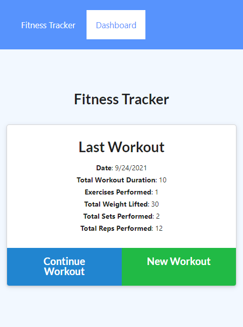
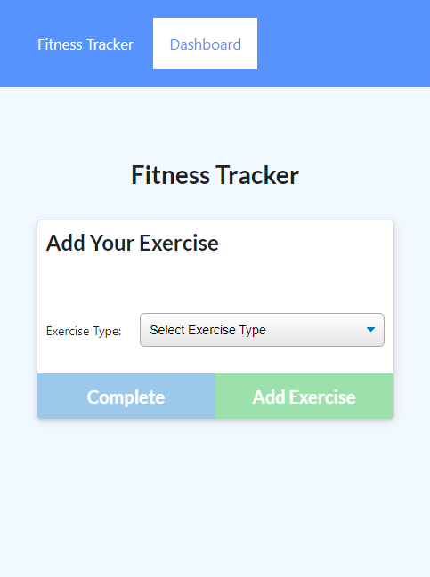
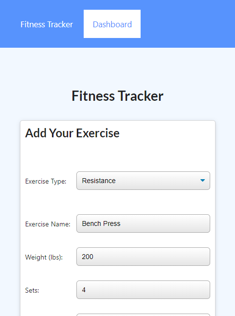
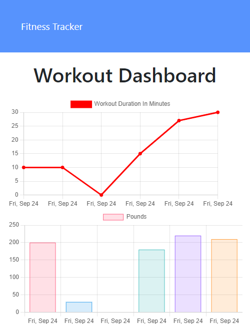

# Fitness Tracker

## Description
This is a fitness tracker app that was built using JavaScript, MongoDB, Mongoose, Node.js, Express.js, and Morgan.

The app allows you to track your fitness workouts, to keep track of the amount of weight lifted, or distance traveled for cardio exercises, the amount of time spent working out, the number of sets performed, and the number of reps.

The dashboard page shows two graphs. The first indicates the total time spend on each workout, and the second shows the total amount of weight lifted for each workout.

You can either add an exercise to the most recent existing workout, or start a new blank workout.

## Deployed Link
This app has been deployed to Heroku at [this link](https://murmuring-lake-01147.herokuapp.com/).

## Screenshots
Main page            | New workout page
:-------------------:|:-------------------:
 | 
Add Exercise         | Fitness Dashboard
 | 

## Questions
If you have questions about this repo, open an issue or contact me directly at todd@theharveysplace.com. You can find more of my work at [tharveyster](https://github.com/tharveyster).

## License
ISC

Copyright 2021 Todd Harvey

Permission to use, copy, modify, and/or distribute this software for any purpose with or without fee is hereby granted, provided that the above copyright notice and this permission notice appear in all copies.

THE SOFTWARE IS PROVIDED "AS IS" AND THE AUTHOR DISCLAIMS ALL WARRANTIES WITH REGARD TO THIS SOFTWARE INCLUDING ALL IMPLIED WARRANTIES OF MERCHANTABILITY AND FITNESS. IN NO EVENT SHALL THE AUTHOR BE LIABLE FOR ANY SPECIAL, DIRECT, INDIRECT, OR CONSEQUENTIAL DAMAGES OR ANY DAMAGES WHATSOEVER RESULTING FROM LOSS OF USE, DATA OR PROFITS, WHETHER IN AN ACTION OF CONTRACT, NEGLIGENCE OR OTHER TORTIOUS ACTION, ARISING OUT OF OR IN CONNECTION WITH THE USE OR PERFORMANCE OF THIS SOFTWARE.